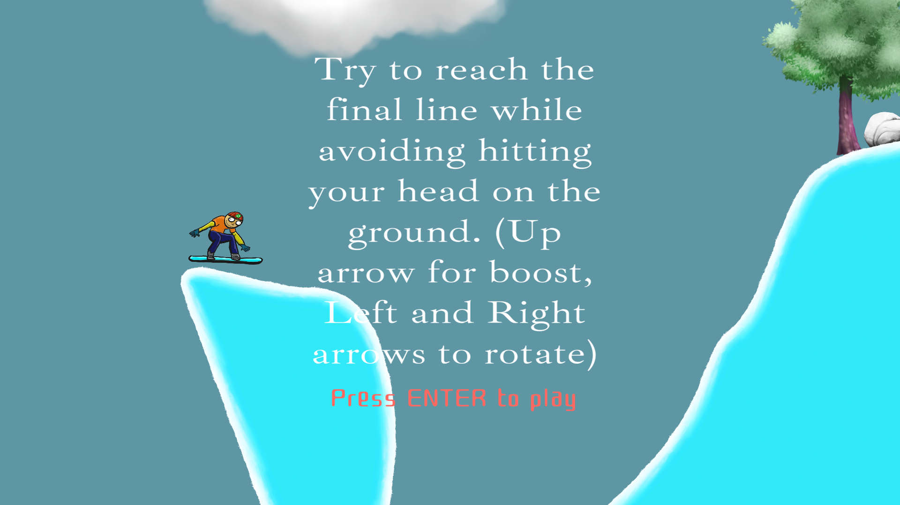
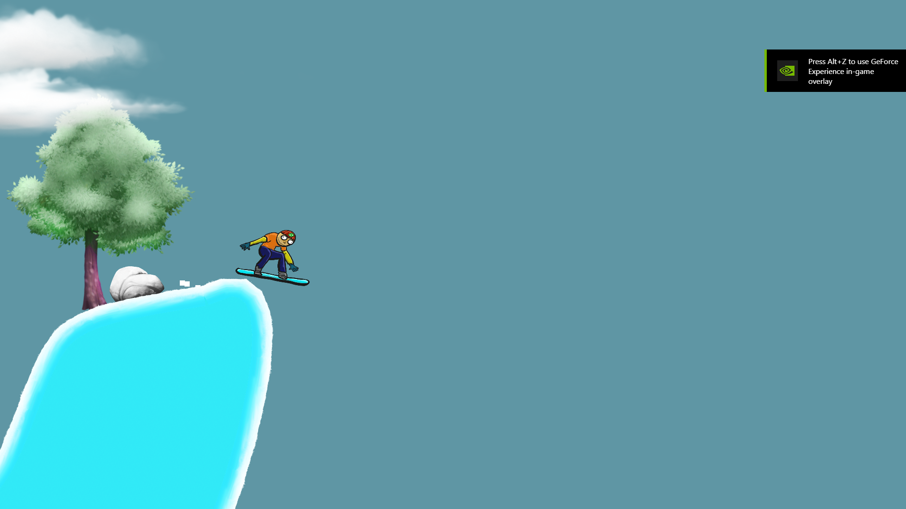

<!-- GAME PROJEC TITLE -->
# SnowBoarder---Game
Game created for study purposes by Matheus Soares Martins, it is a game where you are a snow boarder that have to glide through the snow and mountains until ou reach the end of the level. (Red Post)
Avoid bumping your head on the ground, and getting stuck by using the left and right arrows (or A e D) to rotate your player, and holding down the up arrow (or W) for an extra speed boost for really tall mountains.
 

This game was made to be played by one player, and use simple controls.
 

Game Controls 
- Player controls: 
Left arrow (or A) - Rotates the character to the left 
Right arrow (or D) - Rotates the character to the right 
Up arrow (or W) - While being hold gives an extra speed boost 
ENTER - Starts the game in the beggining, and pause/unpause the game later. 

- Other controls: 
Esc - Closes the game 
F11 - Toggle between fullscreen and windowed mode. 
******************************************************************************

 

# Screenshots
<!-- GAME PROJECT IMAGES -->

# <!-- GAME PROJECT BUILDS -->
# Game download 
## Windows:  https://mega.nz/folder/sV9HlBIJ#A6BDo4W2nat6lN4_IY01KQ
## Mac:  https://mega.nz/folder/5QknGJDT#cwyx3xbRns1XZwXm8ghhSA
## Linux:  https://mega.nz/folder/kUcnzLLT#971nIqhcZVtXxA9EUDgL0w